# Backend Execution Flow Diagram

```mermaid
graph TD
    Start([ASP.NET Core Web API Starts]) --> Program[Program.cs<br/>Main Entry Point]
    
    Program --> ConfigServices[Configure Services<br/>- Add Controllers<br/>- Add CORS Policy]
    ConfigServices --> BuildApp[Build Application]
    BuildApp --> Middleware[Configure Middleware<br/>- Use CORS<br/>- Use Authorization<br/>- Map Controllers]
    Middleware --> Listen[API Listening on Port 5165]
    
    Listen --> WaitRequest[Wait for HTTP Requests]
    
    %% User Authentication Flow
    WaitRequest -->|POST /api/user| UserController[UserController<br/>Login Method]
    UserController --> ValidateUserInput{Validate Request Body<br/>User Model}
    ValidateUserInput -->|Valid| ConnectDB1[Open SQL Connection<br/>Connection String: local_database]
    ValidateUserInput -->|Invalid| Return400_1[Return 400 Bad Request]
    
    ConnectDB1 --> AuthSP[Execute Stored Procedure<br/>AuthenticateUser]
    AuthSP --> SPAuth[SP: Check Email & Password<br/>SELECT from User table]
    SPAuth --> CheckAuth{User Found?}
    CheckAuth -->|Yes| ReturnUser[Return 200 OK<br/>User Object with UserId]
    CheckAuth -->|No| Return401[Return 401 Unauthorized<br/>Login failed message]
    
    %% Product Retrieval - All Products
    WaitRequest -->|GET /api/product| ProductControllerGet[ProductController<br/>Get Method - All Products]
    ProductControllerGet --> ConnectDB2[Open SQL Connection]
    ConnectDB2 --> GetProductSP[Execute Stored Procedure<br/>GetProduct]
    GetProductSP --> SPGetAll[SP: SELECT All Products<br/>with Category, Price, etc.]
    SPGetAll --> ReadProducts[Read SqlDataReader<br/>Loop through all rows]
    ReadProducts --> BuildProductList[Build List of Product Objects]
    BuildProductList --> ReturnProducts[Return 200 OK<br/>List of Products JSON]
    
    %% Product Retrieval - Single Product
    WaitRequest -->|GET /api/product/:id| ProductControllerGetId[ProductController<br/>Get Method - By ID]
    ProductControllerGetId --> ConnectDB3[Open SQL Connection]
    ConnectDB3 --> GetProductByIdSP[Execute Stored Procedure<br/>GetProductById with @ProductId]
    GetProductByIdSP --> SPGetById[SP: SELECT Product WHERE<br/>ProductId = @ProductId]
    SPGetById --> CheckProduct{Product Found?}
    CheckProduct -->|Yes| ReturnSingleProduct[Return 200 OK<br/>Product Object JSON]
    CheckProduct -->|No| Return404[Return 404 Not Found<br/>Product not found message]
    
    %% Cart Retrieval
    WaitRequest -->|GET /api/cart/:userId| CartControllerGet[CartController<br/>GetCartItemsForUser Method]
    CartControllerGet --> ConnectDB4[Open SQL Connection]
    ConnectDB4 --> GetCartSP[Execute Stored Procedure<br/>GetCartItemsForUser with @UserId]
    GetCartSP --> SPGetCart[SP: JOIN CartItem + Cart + Product<br/>WHERE userId = @UserId]
    SPGetCart --> ReadCartItems[Read SqlDataReader<br/>Loop through cart items]
    ReadCartItems --> BuildCartList[Build List of CartItem Objects<br/>with Product Details]
    BuildCartList --> ReturnCart[Return 200 OK<br/>List of CartItems JSON]
    
    %% Add to Cart
    WaitRequest -->|POST /api/cart| CartControllerPost[CartController<br/>Post Method]
    CartControllerPost --> ValidateCartInput{Validate Request Body<br/>CartItem Model}
    ValidateCartInput -->|Valid| ConnectDB5[Open SQL Connection]
    ValidateCartInput -->|Invalid| Return400_2[Return 400 Bad Request]
    
    ConnectDB5 --> AddCartSP[Execute Stored Procedure<br/>AddProductToCart]
    AddCartSP --> SPAddCart[SP: Check if Cart Exists]
    SPAddCart --> CartExists{Cart Exists<br/>for User?}
    CartExists -->|No| CreateCart[Create New Cart<br/>INSERT INTO Cart]
    CartExists -->|Yes| CheckCartItem{Product Already<br/>in Cart?}
    CreateCart --> CheckCartItem
    
    CheckCartItem -->|No| InsertCartItem[INSERT INTO CartItem<br/>quantity = 1]
    CheckCartItem -->|Yes| UpdateCartQty[UPDATE CartItem<br/>quantity = quantity + 1]
    InsertCartItem --> ReturnCartSuccess[Return 200 OK<br/>Success Message]
    UpdateCartQty --> ReturnCartSuccess
    
    %% Update Cart Quantity
    WaitRequest -->|PUT /api/cart/:id/:qty| CartControllerPut[CartController<br/>Put Method]
    CartControllerPut --> ConnectDB6[Open SQL Connection]
    ConnectDB6 --> UpdateQtySP[Execute Stored Procedure<br/>UpdateCartItemQuantity]
    UpdateQtySP --> SPUpdateQty[SP: UPDATE CartItem<br/>SET quantity = @NewQuantity<br/>WHERE cartItemId = @CartItemId]
    SPUpdateQty --> CheckUpdateExists{Cart Item Exists?}
    CheckUpdateExists -->|Yes| ReturnUpdateSuccess[Return 200 OK<br/>Quantity changed message]
    CheckUpdateExists -->|No| Return400_3[Return 400 Bad Request]
    
    %% Delete from Cart
    WaitRequest -->|DELETE /api/cart/:id| CartControllerDelete[CartController<br/>Delete Method]
    CartControllerDelete --> ConnectDB7[Open SQL Connection]
    ConnectDB7 --> DeleteCartSP[Execute Stored Procedure<br/>RemoveProductFromCart]
    DeleteCartSP --> SPDeleteCart[SP: DELETE FROM CartItem<br/>WHERE cartItemId = @cartItemId]
    SPDeleteCart --> ReturnDeleteSuccess[Return 200 OK<br/>Product deleted message]
    
    %% Error Handling
    ConnectDB1 --> TryCatch1{Exception?}
    ConnectDB2 --> TryCatch2{Exception?}
    ConnectDB3 --> TryCatch3{Exception?}
    ConnectDB4 --> TryCatch4{Exception?}
    ConnectDB5 --> TryCatch5{Exception?}
    ConnectDB6 --> TryCatch6{Exception?}
    ConnectDB7 --> TryCatch7{Exception?}
    
    TryCatch1 -->|Error| ReturnError1[Return 400 Bad Request<br/>Exception Message]
    TryCatch2 -->|Error| ReturnError2[Return 400 Bad Request<br/>Exception Message]
    TryCatch3 -->|Error| ReturnError3[Return 400 Bad Request<br/>Exception Message]
    TryCatch4 -->|Error| ReturnError4[Return 400 Bad Request<br/>Exception Message]
    TryCatch5 -->|Error| ReturnError5[Return 400 Bad Request<br/>Exception Message]
    TryCatch6 -->|Error| ReturnError6[Return 400 Bad Request<br/>Exception Message]
    TryCatch7 -->|Error| ReturnError7[Return 400 Bad Request<br/>Exception Message]
    
    %% All responses return to waiting state
    ReturnUser --> WaitRequest
    Return401 --> WaitRequest
    Return400_1 --> WaitRequest
    ReturnProducts --> WaitRequest
    ReturnSingleProduct --> WaitRequest
    Return404 --> WaitRequest
    ReturnCart --> WaitRequest
    ReturnCartSuccess --> WaitRequest
    Return400_2 --> WaitRequest
    ReturnUpdateSuccess --> WaitRequest
    Return400_3 --> WaitRequest
    ReturnDeleteSuccess --> WaitRequest
    ReturnError1 --> WaitRequest
    ReturnError2 --> WaitRequest
    ReturnError3 --> WaitRequest
    ReturnError4 --> WaitRequest
    ReturnError5 --> WaitRequest
    ReturnError6 --> WaitRequest
    ReturnError7 --> WaitRequest
    
    style Start fill:#e1f5ff
    style UserController fill:#fff4e1
    style ProductControllerGet fill:#e8f5e9
    style ProductControllerGetId fill:#e8f5e9
    style CartControllerGet fill:#fce4ec
    style CartControllerPost fill:#fce4ec
    style CartControllerPut fill:#fce4ec
    style CartControllerDelete fill:#fce4ec
    style Listen fill:#f3e5f5
```

## Flow Description

### 1. **Application Startup**
- **Program.cs** serves as the entry point
- Configures services:
  - AddControllers() - Enables MVC controller support
  - AddCors() - Configures CORS policy to allow requests from http://localhost:3000
- Builds the application and configures middleware pipeline
- Maps controllers to route endpoints
- API starts listening on port 5165

### 2. **User Authentication Flow** (POST /api/user)
- **UserController.Login()** receives POST request with User model (Email, Password)
- Opens SQL connection using connection string "local_database"
- Executes **AuthenticateUser** stored procedure with email and password parameters
- Stored Procedure:
  - Queries User table matching email AND password
  - Returns user record if found
- Controller Response:
  - **200 OK** with User object (UserId, Email, Password) if authenticated
  - **401 Unauthorized** if credentials don't match
  - **400 Bad Request** if exception occurs

### 3. **Product Retrieval Flow - All Products** (GET /api/product)
- **ProductController.Get()** receives GET request
- Opens SQL connection
- Executes **GetProduct** stored procedure (no parameters)
- Stored Procedure:
  - SELECT all products with all fields (ProductId, CategoryId, ProductName, UnitPrice, Manufacturer, Description, Rating, SKU, ImageLink)
- Reads SqlDataReader row by row
- Builds List<Product> from database results
- Returns **200 OK** with JSON array of all products
- Returns **400 Bad Request** if exception occurs

### 4. **Product Retrieval Flow - Single Product** (GET /api/product/:id)
- **ProductController.Get(int id)** receives GET request with productId route parameter
- Opens SQL connection
- Executes **GetProductById** stored procedure with @ProductId parameter
- Stored Procedure:
  - SELECT product WHERE ProductId matches parameter
- Controller Response:
  - **200 OK** with Product object if found
  - **404 Not Found** if product doesn't exist
  - **400 Bad Request** if exception occurs

### 5. **Cart Retrieval Flow** (GET /api/cart/:userId)
- **CartController.GetCartItemsForUser(int userId)** receives GET request
- Opens SQL connection
- Executes **GetCartItemsForUser** stored procedure with @UserId parameter
- Stored Procedure:
  - Performs JOIN on CartItem, Cart, and Product tables
  - Filters by userId from Cart table
  - Returns cart items with full product details
- Builds List<CartItem> with product information
- Returns **200 OK** with JSON array of cart items
- Returns **400 Bad Request** if exception occurs

### 6. **Add to Cart Flow** (POST /api/cart)
- **CartController.Post()** receives POST request with CartItem model (UserId, ProductId)
- Opens SQL connection
- Executes **AddProductToCart** stored procedure
- Stored Procedure Logic:
  1. Check if cart exists for user
  2. If no cart exists, create new cart with INSERT INTO Cart
  3. Check if product already exists in user's cart
  4. If product doesn't exist, INSERT new CartItem with quantity = 1
  5. If product exists, UPDATE CartItem quantity (increment by 1)
- Returns **200 OK** with success message
- Returns **400 Bad Request** if exception occurs

### 7. **Update Cart Quantity Flow** (PUT /api/cart/:cartItemId/:quantity)
- **CartController.Put(int cartItemId, int quantity)** receives PUT request
- Opens SQL connection
- Executes **UpdateCartItemQuantity** stored procedure with @CartItemId and @NewQuantity
- Stored Procedure:
  - Checks if cart item exists
  - UPDATE CartItem SET quantity = @NewQuantity WHERE cartItemId matches
- Returns **200 OK** with "Quantity changed" message
- Returns **400 Bad Request** if exception occurs

### 8. **Delete from Cart Flow** (DELETE /api/cart/:cartItemId)
- **CartController.Delete(int cartItemId)** receives DELETE request
- Opens SQL connection
- Executes **RemoveProductFromCart** stored procedure with @cartItemId parameter
- Stored Procedure:
  - DELETE FROM CartItem WHERE cartItemId matches
- Returns **200 OK** with success message
- Returns **400 Bad Request** if exception occurs

### 9. **Error Handling**
- All controller actions wrapped in try-catch blocks
- Database connection errors caught and returned as 400 Bad Request
- SQL exceptions include error message in response
- After each response (success or error), API returns to waiting state for next request

## Database Architecture

### Tables Used:
- **User** - Stores user information (UserId, Email, Password, AddressId)
- **Product** - Stores product catalog (ProductId, CategoryId, ProductName, UnitPrice, etc.)
- **Category** - Product categories (Tops, Bottoms, Outerwear, Shoes)
- **Cart** - User shopping carts (CartId, UserId)
- **CartItem** - Items in carts (CartItemId, CartId, ProductId, Quantity)

### Stored Procedures:
1. **AuthenticateUser** - Validates user credentials
2. **GetProduct** - Retrieves all products
3. **GetProductById** - Retrieves single product by ID
4. **GetCartItemsForUser** - Gets user's cart with product details (JOIN operation)
5. **AddProductToCart** - Adds or updates product in cart
6. **UpdateCartItemQuantity** - Updates quantity of cart item
7. **RemoveProductFromCart** - Deletes cart item

## Key Backend Technologies
- **ASP.NET Core 7.0** - Web API framework
- **C#** - Programming language
- **SQL Server** - Database
- **System.Data.SqlClient** - Database connectivity
- **Stored Procedures** - Database logic encapsulation
- **RESTful API** - API design pattern
- **CORS** - Cross-origin resource sharing for frontend integration
- **Dependency Injection** - IConfiguration for connection strings

