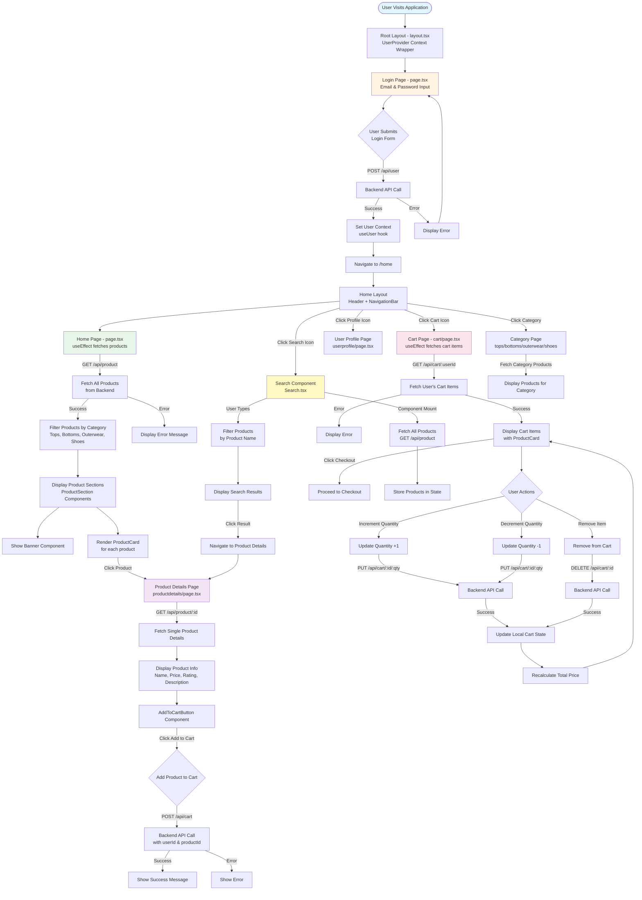

# Frontend Execution Flow Diagram

## Flow Description

### 1. **Application Entry & Authentication**
- User starts at the Root Layout which wraps the app with UserProvider context
- Login page collects email and password
- On submit, makes POST request to `/api/user`
- On success, stores user data in context and navigates to home

### 2. **Home Page Flow**
- Home Layout renders Header (with logo, search, profile, cart icons) and NavigationBar
- Home Page fetches all products via GET `/api/product`
- Products are filtered by category (Tops, Bottoms, Outerwear, Shoes)
- ProductSection components display 4 products per category
- Each product is rendered as a ProductCard

### 3. **Product Details Flow**
- User clicks on a ProductCard
- Navigates to Product Details page with productId query parameter
- Fetches specific product via GET `/api/product/:id`
- Displays full product information with AddToCartButton
- User can add product to cart (POST `/api/cart`)

### 4. **Cart Management Flow**
- User clicks cart icon in Header
- Cart page fetches user's cart items via GET `/api/cart/:userId`
- Displays each cart item with ProductCard
- User can:
  - Increment/decrement quantity (PUT `/api/cart/:id/:quantity`)
  - Remove items (DELETE `/api/cart/:id`)
- Cart total is recalculated after each action
- User can proceed to checkout

### 5. **Search Functionality**
- Search component fetches all products on mount
- User types in search box
- Products are filtered by name in real-time (client-side)
- User can select result to navigate to Product Details

### 6. **Navigation**
- Header provides quick access to Home, Profile, Cart
- NavigationBar allows browsing by category
- Category pages display filtered products

## Key Frontend Technologies
- **Next.js 13+** with App Router
- **React Hooks**: useState, useEffect, useContext
- **Context API**: User context for global state management
- **Client-side routing**: next/navigation
- **API Integration**: Fetch API for backend communication

