# E-Commerce Project Folder Structure

```mermaid
graph TB
    Root["📁 E-Commerce Project Root"]
    
    Root --> RootFiles["📄 Root Files<br/>package.json<br/>README.md"]
    
    Root --> FE["📁 FrontEnd/"]
    Root --> BE["📁 BackEnd/"]
    Root --> DB["📁 Database/"]
    Root --> UT["📁 UnitTestsAPI/"]
    
    %% FrontEnd Structure
    FE --> FE_Config["📄 Config Files<br/>next.config.js<br/>tsconfig.json<br/>jest.config.js<br/>package.json"]
    
    FE --> FE_Public["📁 public/<br/>├─ next.svg<br/>└─ vercel.svg"]
    
    FE --> FE_Src["📁 src/"]
    
    FE_Src --> App["📁 app/"]
    FE_Src --> Components["📁 components/"]
    FE_Src --> Assets["📁 assets/"]
    FE_Src --> Tests["📁 tests/"]
    
    App --> AppRoot["📄 Root Level<br/>├─ layout.tsx<br/>├─ page.tsx (Login)<br/>├─ user.tsx (Context)<br/>└─ globals.css"]
    
    App --> Home["📁 home/"]
    Home --> HomeFiles["📄 Home Files<br/>├─ layout.tsx<br/>├─ page.tsx<br/>└─ page.module.css"]
    
    Home --> Cart["📁 cart/<br/>├─ page.tsx<br/>└─ checkout/"]
    Home --> ProductDetails["📁 productdetails/<br/>└─ page.tsx"]
    Home --> Tops["📁 tops/"]
    Home --> Bottoms["📁 bottoms/"]
    Home --> Outerwear["📁 outerwear/"]
    Home --> Shoes["📁 shoes/"]
    Home --> UserProfile["📁 userprofile/"]
    Home --> Sales["📁 sales/"]
    
    Components --> AddToCart["📁 AddToCartButton/<br/>├─ AddToCartButton.tsx<br/>└─ AddToCartButton.module.css"]
    Components --> Banner["📁 Banner/<br/>├─ Banner.tsx<br/>└─ Banner.module.css"]
    Components --> Header["📁 Header/<br/>├─ Header.tsx<br/>└─ Header.module.css"]
    Components --> Nav["📁 NavigationBar/<br/>├─ NavigationBar.tsx<br/>└─ NavigationBar.module.css"]
    Components --> PCard["📁 ProductCard/<br/>├─ ProductCard.tsx<br/>└─ ProductCard.module.css"]
    Components --> PSection["📁 ProductSection/<br/>├─ ProductSection.tsx<br/>└─ ProductSection.module.css"]
    Components --> Search["📁 Search/<br/>├─ Search.tsx<br/>└─ Search.module.css"]
    Components --> OrderSum["📁 OrderSummary/"]
    Components --> ReviewOrder["📁 ReviewOrder/"]
    
    Assets --> AssetFolders["📁 Image Folders<br/>├─ Banner Images/<br/>├─ Header Images/<br/>├─ Product Images/<br/>└─ Login Page/"]
    
    Tests --> TestFiles["📄 Test Files<br/>├─ AddToCartButton.test.js<br/>├─ Banner.test.js<br/>├─ Header.test.js<br/>├─ NavigationBar.test.js<br/>├─ ProductCard.test.js<br/>├─ ProductSection.test.js<br/>├─ Search.test.js<br/>└─ __snapshots__/"]
    
    %% BackEnd Structure
    BE --> BE_Config["📄 Configuration<br/>├─ appsettings.json<br/>├─ appsettings.Development.json<br/>└─ Properties/launchSettings.json"]
    
    BE --> BE_Project["📄 Project Files<br/>├─ Program.cs<br/>├─ ExampleAPI.csproj<br/>└─ ExampleAPI.sln"]
    
    BE --> Controllers["📁 Controllers/<br/>├─ UserController.cs<br/>├─ ProductController.cs<br/>└─ CartController.cs"]
    
    BE --> Models["📁 Models/<br/>├─ User.cs<br/>├─ Product.cs<br/>└─ CartItem.cs"]
    
    BE --> BE_Bin["📁 bin/Debug/net7.0/<br/>├─ ExampleAPI (binary)<br/>├─ ExampleAPI.dll<br/>└─ dependencies/"]
    
    BE --> BE_Obj["📁 obj/<br/>└─ build artifacts"]
    
    %% Database Structure
    DB --> CreateDB["📄 createDB.sql"]
    
    CreateDB --> Tables["📊 Table Definitions<br/>├─ User<br/>├─ Product<br/>├─ Category<br/>├─ Cart<br/>├─ CartItem<br/>├─ Order<br/>├─ OrderItem<br/>├─ Address<br/>├─ Payment<br/>└─ Sale"]
    
    CreateDB --> SPs["⚙️ Stored Procedures<br/>├─ AuthenticateUser<br/>├─ GetProduct<br/>├─ GetProductById<br/>├─ GetCartItemsForUser<br/>├─ AddProductToCart<br/>├─ UpdateCartItemQuantity<br/>└─ RemoveProductFromCart"]
    
    CreateDB --> SeedData["📥 Sample Data<br/>└─ INSERT statements"]
    
    %% Unit Tests Structure
    UT --> UT_Project["📄 Project Files<br/>├─ UnitTestsAPI.csproj<br/>└─ GlobalUsings.cs"]
    
    UT --> UT_Interfaces["📄 Mock Interfaces<br/>├─ IConfigurationWrapper.cs<br/>└─ IUserService.cs"]
    
    UT --> UT_Tests["📄 Test Files<br/>├─ UserControllerTests.cs<br/>└─ ProductControllerTests.cs"]
    
    UT --> UT_Build["📁 Build Output<br/>├─ bin/Debug/net7.0/<br/>└─ obj/"]
    
    style Root fill:#e1f5ff,stroke:#01579b,stroke-width:3px
    style FE fill:#e8f5e9,stroke:#2e7d32,stroke-width:2px
    style BE fill:#fff4e1,stroke:#f57c00,stroke-width:2px
    style DB fill:#fce4ec,stroke:#c2185b,stroke-width:2px
    style UT fill:#f3e5f5,stroke:#7b1fa2,stroke-width:2px
    style FE_Src fill:#c8e6c9
    style App fill:#a5d6a7
    style Home fill:#81c784
    style Components fill:#fff9c4
    style Controllers fill:#ffe0b2
    style Models fill:#ffccbc
    style CreateDB fill:#f8bbd0
```

## Folder Structure Overview

### **📁 FrontEnd/** - Next.js 13+ React Application

#### Configuration Files
- `next.config.js` - Next.js configuration
- `tsconfig.json` - TypeScript configuration
- `jest.config.js` - Jest testing configuration
- `package.json` - NPM dependencies

#### Public Assets
- `public/` - Static files (SVGs)

#### Source Code (`src/`)

**App Router Structure (`src/app/`):**
- **Root Level:**
  - `layout.tsx` - Root layout with UserProvider context
  - `page.tsx` - Login page
  - `user.tsx` - User context definition
  - `globals.css` - Global styles

- **Home Area (`home/`):**
  - `layout.tsx` - Layout with Header + Navigation + Footer
  - `page.tsx` - Product catalog display
  - `page.module.css` - Home page styles
  
  **Sub-routes:**
  - `cart/` - Shopping cart and checkout
  - `productdetails/` - Individual product view
  - `tops/`, `bottoms/`, `outerwear/`, `shoes/` - Category pages
  - `userprofile/` - User account management
  - `sales/` - Promotional pages

**Reusable Components (`src/components/`):**
- `AddToCartButton/` - Add to cart functionality
- `Banner/` - Promotional banner
- `Header/` - Logo, search, profile, cart icons
- `NavigationBar/` - Category navigation
- `ProductCard/` - Product display card
- `ProductSection/` - Category product grouping
- `Search/` - Search functionality
- `OrderSummary/` - Order summary display
- `ReviewOrder/` - Order review component

**Assets (`src/assets/`):**
- `Banner Images/` - Banner promotional images
- `Header Images/` - Logo and header icons
- `Product Images/` - Product photos
- `Login Page/` - Login page assets

**Tests (`src/tests/`):**
- Component test files (`.test.js`)
- `__snapshots__/` - Jest snapshot tests

---

### **📁 BackEnd/** - ASP.NET Core 7.0 Web API

#### Configuration
- `appsettings.json` - App configuration
- `appsettings.Development.json` - Development settings
- `Properties/launchSettings.json` - Launch profiles

#### Project Files
- `Program.cs` - Application entry point with CORS
- `ExampleAPI.csproj` - Project file
- `ExampleAPI.sln` - Solution file

#### Controllers
- `UserController.cs` - User authentication (POST /api/user)
- `ProductController.cs` - Product operations (GET /api/product)
- `CartController.cs` - Cart management (CRUD /api/cart)

#### Models
- `User.cs` - User data model
- `Product.cs` - Product data model
- `CartItem.cs` - Cart item data model

#### Build Output
- `bin/Debug/net7.0/` - Compiled binaries and dependencies
- `obj/` - Build artifacts

---

### **📁 Database/** - SQL Server Database

#### createDB.sql Contents:

**Table Definitions:**
- `User` - User accounts
- `Product` - Product catalog
- `Category` - Product categories
- `Cart` - Shopping carts
- `CartItem` - Cart items
- `Order` - Completed orders
- `OrderItem` - Order line items
- `Address` - Addresses
- `Payment` - Payment information
- `Sale` - Promotional sales

**Stored Procedures:**
- `AuthenticateUser` - Login validation
- `GetProduct` - Retrieve all products
- `GetProductById` - Get single product
- `GetCartItemsForUser` - Get user's cart with JOIN
- `AddProductToCart` - Add/update cart items
- `UpdateCartItemQuantity` - Modify quantities
- `RemoveProductFromCart` - Delete cart items

**Sample Data:**
- INSERT statements for testing

---

### **📁 UnitTestsAPI/** - Backend Unit Tests

#### Project Files
- `UnitTestsAPI.csproj` - Test project file
- `GlobalUsings.cs` - Global using statements

#### Mock Interfaces
- `IConfigurationWrapper.cs` - Configuration mock
- `IUserService.cs` - User service mock

#### Test Files
- `UserControllerTests.cs` - User controller tests
- `ProductControllerTests.cs` - Product controller tests

#### Build Output
- `bin/Debug/net7.0/` - Test binaries
- `obj/` - Test build artifacts

---

## Visual Legend

- 📁 = Folder
- 📄 = File(s)
- 📊 = Database Tables
- ⚙️ = Stored Procedures
- 📥 = Data Inserts

## Color Coding

- **Blue** - Root project
- **Green** - Frontend (Next.js/React)
- **Orange** - Backend (ASP.NET Core)
- **Pink** - Database (SQL Server)
- **Purple** - Unit Tests

